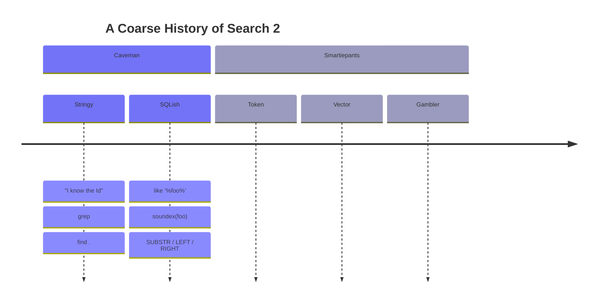
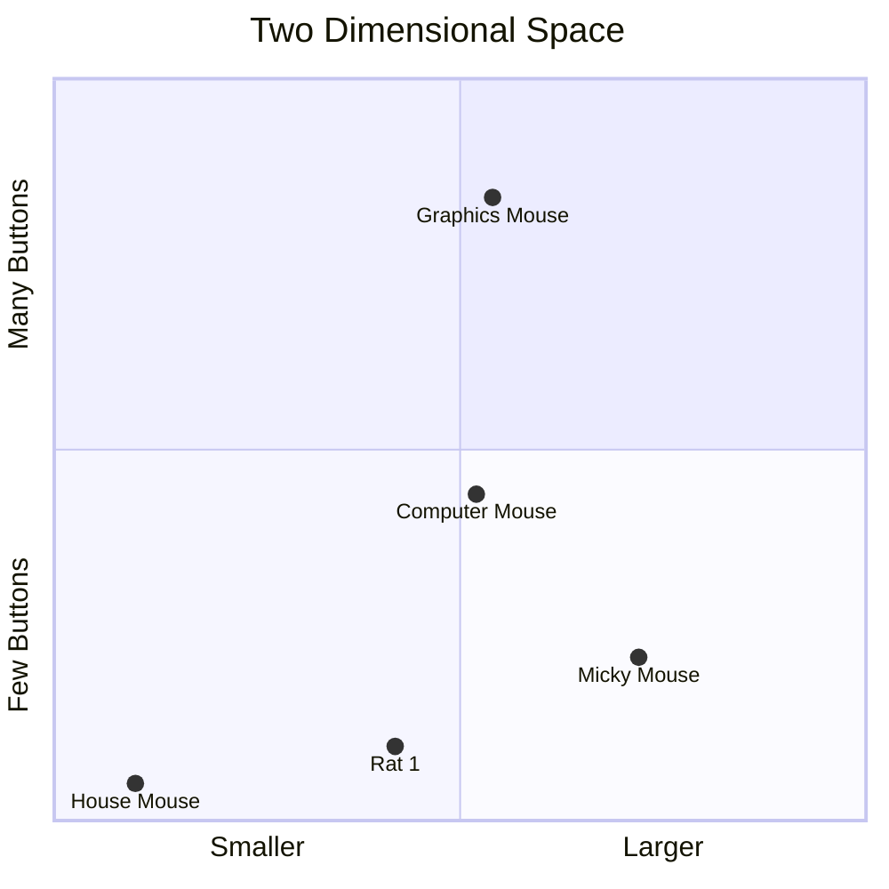
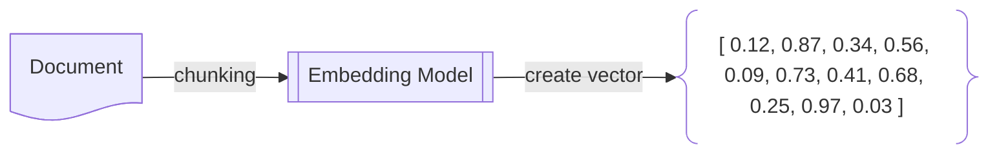
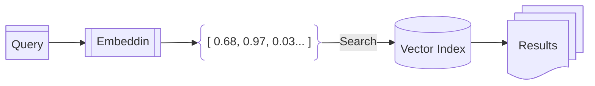
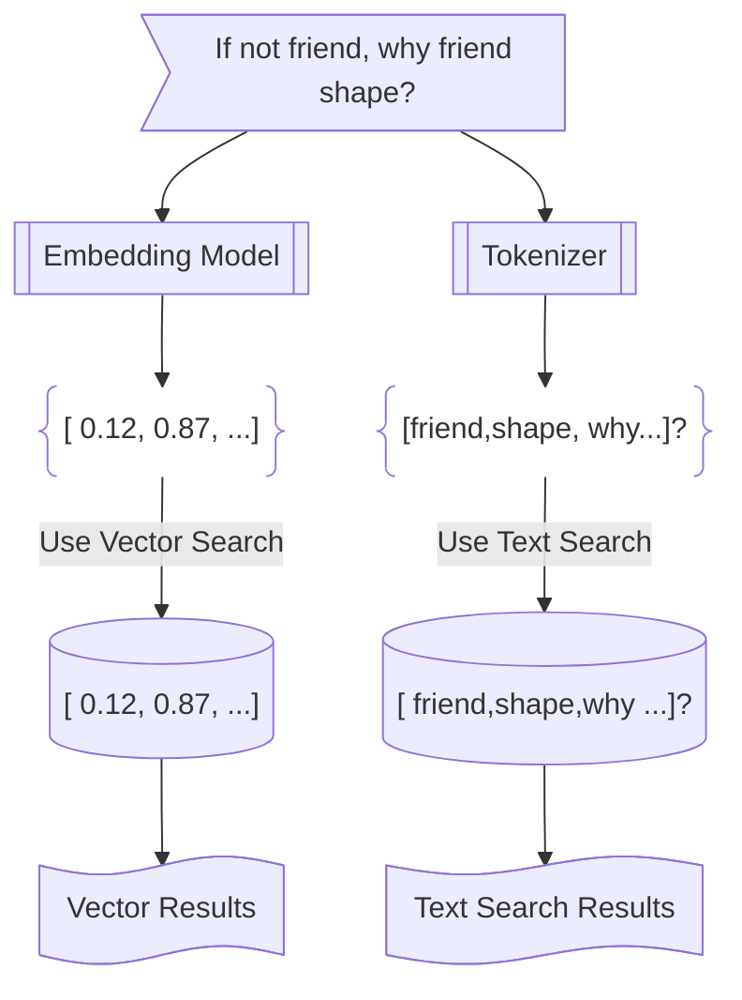
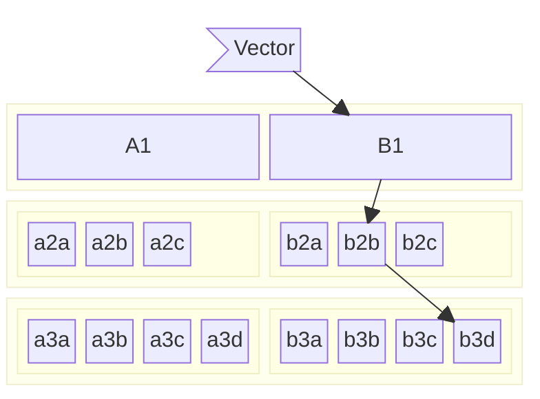

# Diagrams

```mermaid
---
config:
  theme: neo
---
timeline
    title A Coarse History of Search 2
    Section Caveman
      Stringy
        : "I know the Id"
        : grep
        : find .
      SQLish
        : like '%foo%'
        : soundex(foo)
        : SUBSTR / LEFT / RIGHT
    Section Smartiepants
      Token
        %% : Lucene / Solr / Elastic
        %% : Stemming / Linguistics
        %% : Scoring / Tuning
      Vector
        %% : Vector Index
      Gambler 
        %% : Annoying summary that takes time and is wildly inaccurate
```

```mermaid
quadrantChart
    title Two Dimensional Space
    y-axis Few Buttons --> Many Buttons
    x-axis Smaller --> Larger
    %% quadrant-1 Big With Buttons
    House Mouse: [0.10, 0.05]
    Rat 1: [0.42, 0.10]
    Micky Mouse: [0.72, 0.22]
    Computer Mouse: [0.52, 0.44]
    Graphics Mouse: [0.54, 0.84]

```

```mermaid

flowchart LR
    A@{ shape: doc, label: "Document" }
    T@{ shape: subproc, label: "Embedding Model" }
    V@{ shape: braces, label: "[ 0.12, 0.87, 0.34, 0.56, 0.09, 0.73, 0.41, 0.68, 0.25, 0.97, 0.03 ]" }
    A -- chunking --> T
    T -- create vector --> V

```

```mermaid
flowchart LR
    Q@{ shape: div-rect, label: "Query" }
    T@{ shape: subproc, label: "Embeddin" }
    V@{ shape: braces, label: "[ 0.68, 0.97, 0.03... ]" }
    DB@{shape: database, label: "Vector Index" }
    DOC@{ shape: documents, label: "Results"}
    Q --> T
    T --> V
    V -- Search --> DB
    DB --> DOC
```

```mermaid
flowchart TD
    Q@{shape: odd, label: "If not friend, why friend shape?" }
    VE@{ shape: subproc, label: "Embedding Model" }
    VV@{ shape: braces, label: "[ 0.12, 0.87, ...]" }
    VI@{ shape: db, label: "[ 0.12, 0.87, ...]" }
    VR@{shape: flag, label: "Vector Results"}


    TE@{ shape: subproc, label: "Tokenizer" }
    TV@{ shape: braces, label: "[friend,shape, why...]?" }
    TI@{ shape: db, label: "[ friend,shape,why ...]?" }
    TR@{shape: flag, label: "Text Search Results"}
    
    Q --> VE
    VE --> VV
    VV --Use Vector Search--> VI
    VI --> VR
    
    Q --> TE
    TE --> TV
    TV --Use Text Search--> TI
    TI --> TR

```

```mermaid
block
columns 1
  q >"Vector"]

  block:top
    A1
    B1   
  end

  block:mid
    block
      a2a
      a2b
      a2c
    end
    block
      b2a
      b2b
      b2c
    end
  end
  block
      block
      a3a
      a3b
      a3c
      a3d
    end
    block
      b3a
      b3b
      b3c
      b3d
    end
end
  q-->B1
  B1-->b2b
  b2b-->b3d
  
  
  
```