# Is Vector Search Right for Me?

> A talk about Vector Search,

---

## Search Overview

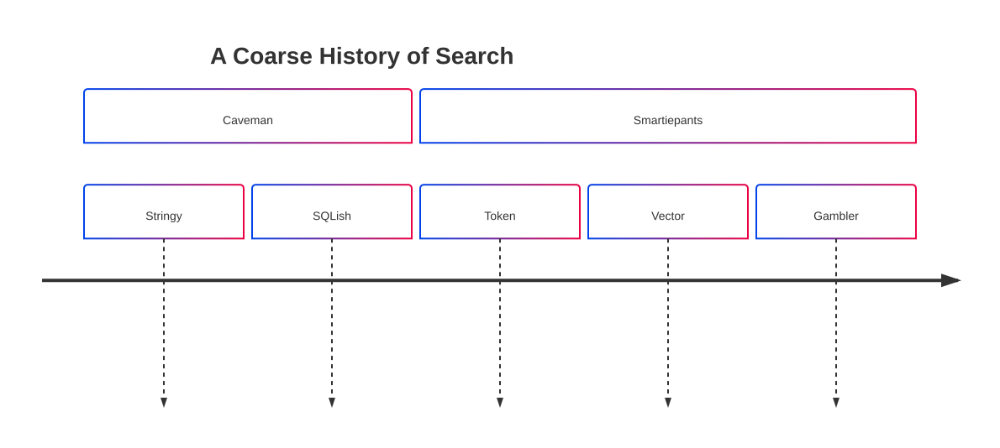

---

## Caveman Era I

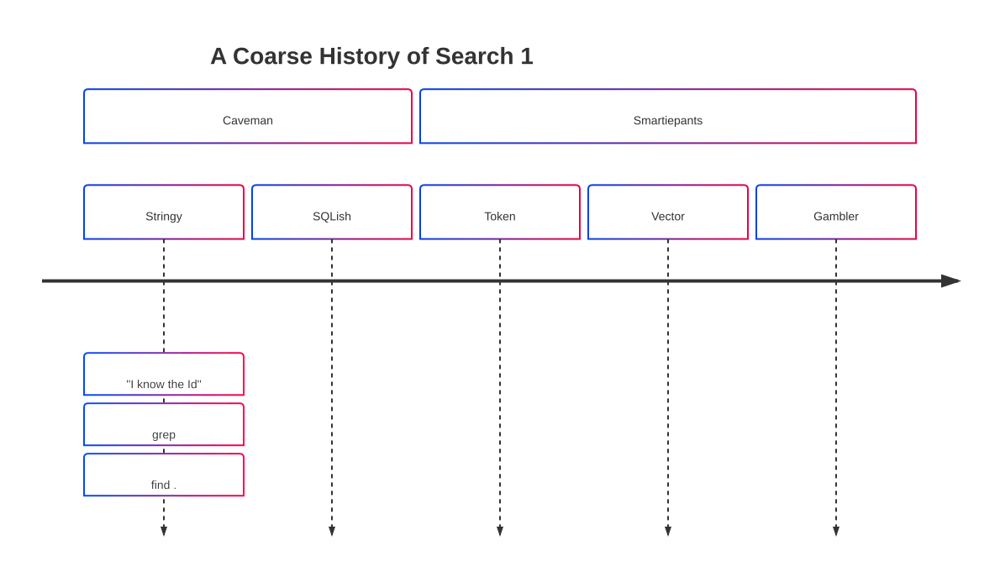

---

## Caveman Era II

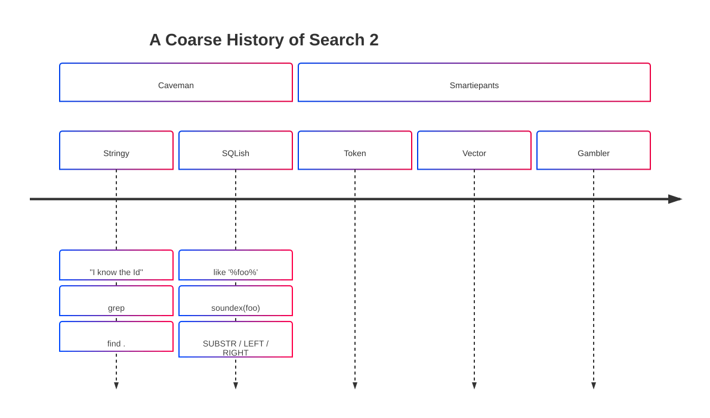

---

## Enlightment I

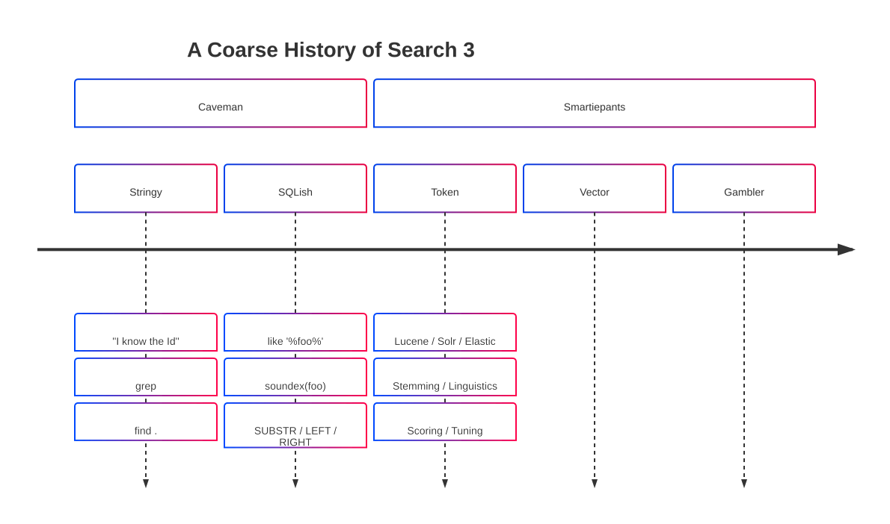

---

## Enlightment II

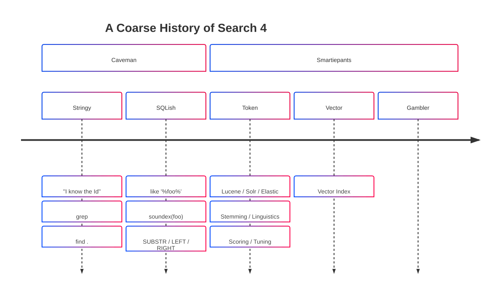

---

## Enlightment III

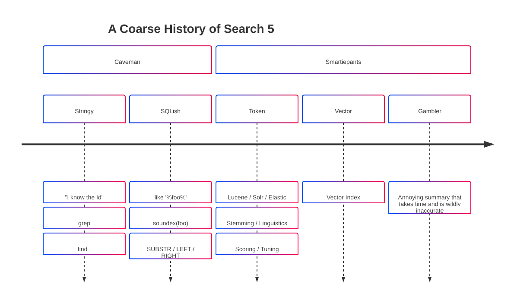

---

## Index

> Avoids **scanning** for results.
> Direct **pre-indexed** pointers.

---

## Token Era + Index

1. Prepare:
    1. Split documents to tokens (words)
    1. Create index `token` -> `documnet`s
1. Use:
    1. Split query into `token`s
    1. Find documents using `index`
    1. Rank results by those that contain the most tokens *

---

## Token Issues

1. "I saw a dead :mouse:"
1. "My :computer_mouse: died."

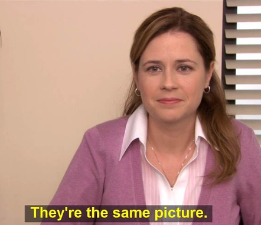

---

## Vector

- Set of points along N-axis
- Distance between points indicates similarity
- N-Dimensional

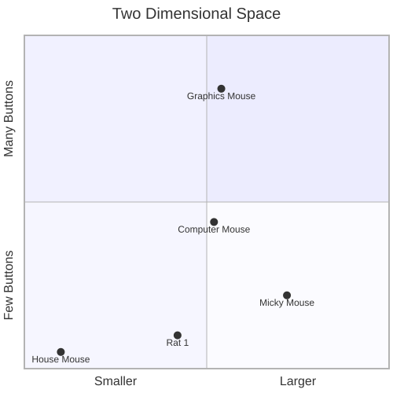

---

## Embedding


* The `Embedding Model` does the heavy lifting.
* It is trained (or programmed) to project documents with similar semantic meaning into the same spatial region, and dissimilar ones far apart.

---

## Searching

At runtime, user **query** is converter to a `vector` that is searched against a `vector index` (database) which then retrieves the semantically similar documents.

---

## Equality & Likeness

Scalar comparison

|Operation| Example | Meaning|
|---|---|---|
|`=`| 2 `=` 2 | Are two values equal|
|`>` / `<` | 2 `>` 1 and 2 `<` 4 | Values in a range|

But what about **vector** comparison?

Is `[1,2]`, `[1,1]`, `[2,1]` equal? in some range? How?

---

## Vector Nearness

### TL;DR
>
> Math!

### Numerical methods

1. Euclidean: $d = \sqrt{(x_2 - x_1)^2 + (y_2 - y_1)^2}$
1. Cosine: $d = \frac{x_1 x_2 + y_1 y_2}{\sqrt{x_1^2 + y_1^2} \, \sqrt{x_2^2 + y_2^2}}$
1. Dot Product: $d = x_1 x_2 + y_1 y_2$

---

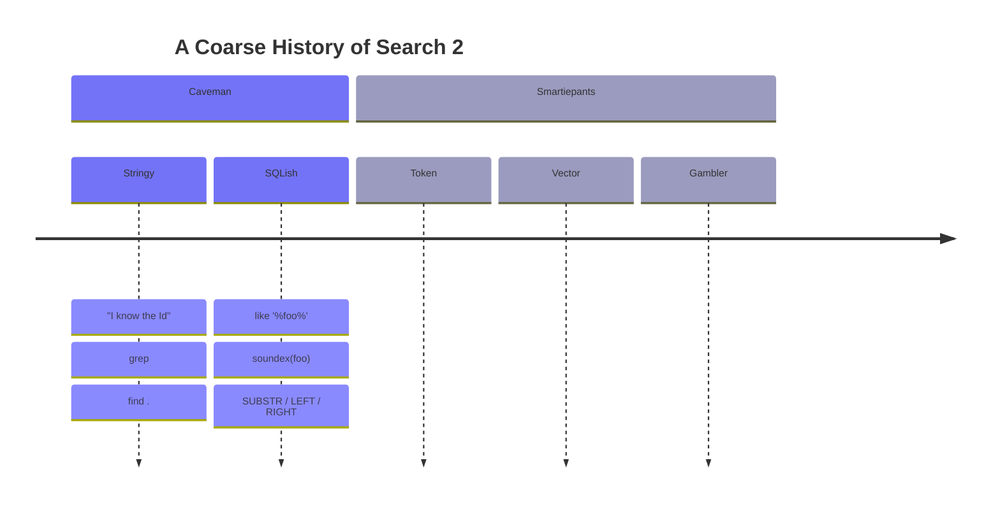

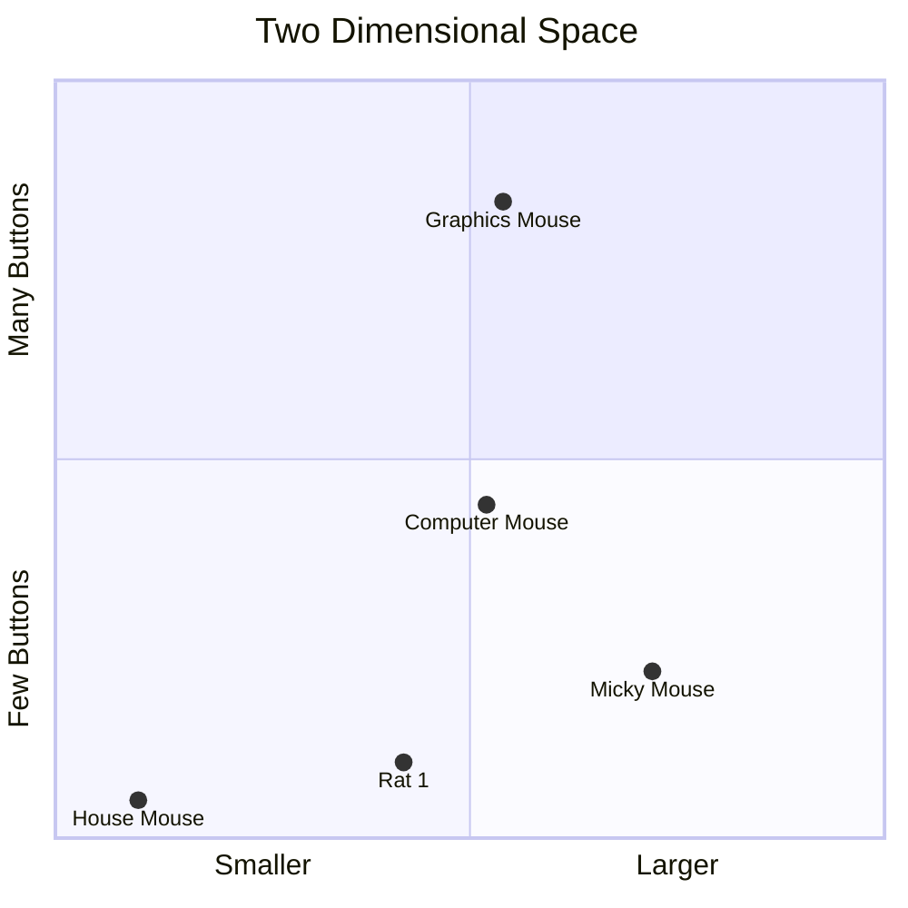

---

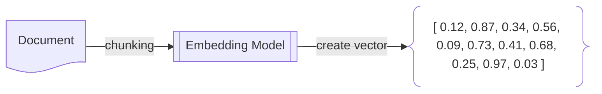

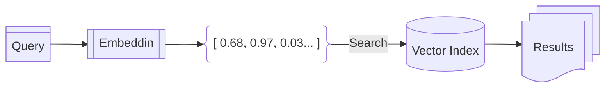

## Outline

- C'est Ci Nest pas un Sales Pitch
- Covered:

  - What is Vector Search
    - From Text to Vector
      - Embedding
      - Your Own?
        - Train
        - Handmade
      - Vector Index
        - HNSW
        - D
  - Vector Comparison
    - How does it differ from token match?
    - How Token match works*
    - Examp
  - What to expect
  - What it doesn't do
  - Mechanisms in the wild
