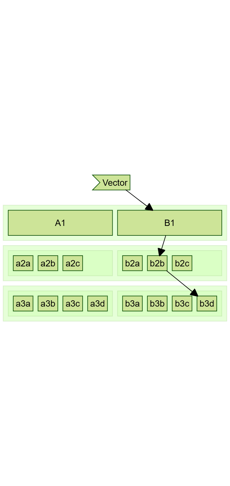

# Is Vector Search Right for Me?

> A talk about Vector Search

---

## Outline

* What is Vector Search
  * From Text to Vector
    * Embedding
    * Your Own? Train / Algorithm
    * Vector Index: HNSW / IVF
* Vector Comparison
  * How does it differ from token match?
  * Demo / code review?
* What it doesn't do  

---

## Search Overview

---

## Caveman Era I

---

## Caveman Era II

---

## Enlightment I

---

## Enlightment II

---

## Enlightment III

---

## Index

> Avoids **scanning** for results.
> Direct **pre-indexed** pointers.

---

## Token Era + Index

* ### Prepare

    1. Split documents to tokens (words)
    1. Create index: `token` ⇒ `documnet`s

* ### Use

    1. Split query into `token`s
    1. Find documents using `index`
    1. Rank results by those that contain the most tokens *

---

## Token Match Example

Consider the query "Great dog show":

|Corpus|Match|
|---|---|
|The Westminster `dog` `show`|✅✅|
|The movie "Best in `show`" was `great`!|✅✅|
|The `Great` British Bake Off|✅|
|Nathen's Hot `Dog` Eating Contest is awesome!|✅|
|Canadian Kennel Club National Championship|❌|

---

## Token Issues

1. "I saw a dead :mouse:"
1. "My :computer_mouse: died."

---

## Vector

- List of values along N-axis `[0.2,0.9,0.1,...]`
- Distance between points indicates similarity
- N-Dimensional

---

## Embedding

> A fingerprint for the document :magic_wand: 👍️ :printer:

* The `Embedding Model` does the heavy lifting.
* It is trained (or programmed) to project documents with similar semantic meaning into the same spatial region, and dissimilar ones far apart.

---

## Searching

User `query` is converter into a `vector` that is searched against a `vector index`1 which then retrieves the semantically similar documents 2.

* _1 Database or pure index_
* _2 Document or pointer to document_

---

## Equality & Likeness

Scalar comparison

|Operation| Example | Meaning|
|---|---|---|
|`=`| 2 `=` 2 | Are two values equal|
|`>` / `<` | 2 `>` 1 and 2 `<` 4 | Values in a range|

But what about **vector** comparison?

Is `[1,2]`, `[1,1]`, `[2,1]` equal? in some range? How?

---

## Vector Nearness

**TL;DR** : "It's Math!"

|Method| Formula|
|---|---|
|Euclidean| $d = \sqrt{(x_2 - x_1)^2 + (y_2 - y_1)^2}$|
|Cosine| $d = \frac{x_1 x_2 + y_1 y_2}{\sqrt{x_1^2 + y_1^2} \, \sqrt{x_2^2 + y_2^2}}$|
|Dot Product*| $d = x_1 x_2 + y_1 y_2$|

* Dot product is not similarity measure

---

## Vector Index

> Traversable layers of vector groupings

* Drill from coarse to granular.
* Reduces runtime compute to a small subset of vector comparisons.

(**H**ierarchical **N**avigable **S**mall **W**orld)

---

## Demo

A side by side search of text and vector indecies

---

## Maybe Not?

* Result Control
  * Few "Knobs to turn"
    * Chunking (How you feed it)
    * Embedding model (What it produces)
  * Reranking

* Cost

  * Model training cost / rent
  * Embedding speed
  * Re-Ranking

---

## Thanks

### By

linkedin/ @nurih | 818.446.NUHA

### Demo Dataset

`SentenceTransformer("thenlper/gte-base")`, Book dataset adapted from MongoDB Developer Days workshop

### Slides

 `marp`
